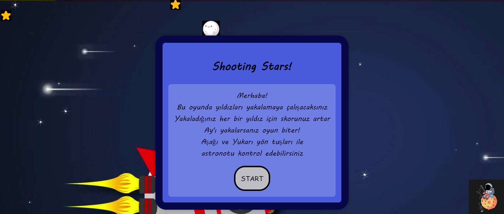

# Shooting Stars Game
Bu proje, basit bir kayan yıldızları yakalama oyunudur.   
Oyunun amacı, ekranda rastgele hareket eden yıldızları yakalamaya çalışmaktır.   
Yıldız yakaladıkça skor artar ancak Ay yakalanırsa oyun biter!

## Oyun Nasıl Oynanır?
Oyun web sitesi yüklendikten ve karşımıza çıkan başlangıç penceresinde oyun yönergelerini okuduktan sonra **START** butonuna tıklayarak oynamaya başlayabililriz.  
**Aşağı** ve **Yukarı** yön tuşlarını kullanarak astronotu hareket ettirebilir, yıldızları yakalamaya çalışır, skorumuzu yükseltiriz.  
**Ay**'ı yakalarsak oyun biter. Oyun bitiş ekranı açılınca tekrar yönergeleri takip ederek **RESTART** butonuna veya **ENTER** tuşuna tıklayarak oyuna yeniden başlayabiliriz.

## Oyun Görselleri

## Kullanılan Teknolojiler
HTML, CSS, JavaScript dilleri kullanılarak yazılan web tabanlı bir oyun

## Oyunu Şuradan Oynayabilirsiniz
[Shooting Stars](https://rojda-o.github.io/shooting_stars_game.github.io/)
